# Old site walkthrough from `gazma site.mp4`

## Summary

This document captures the actual old site structure from the navigation recording `old-website-assets/Assets Gazma Site/gazma site.mp4`.

Unlike the ambient `.mov` files, this video shows the real pages, section order, and visual hierarchy of the legacy website.

Extracted frames live in:

- `docs/video-reference/site-walkthrough`

## Global navigation

Primary nav observed in the walkthrough:

- Accueil
- Qui sommes nous
- Nos artistes
- Evenements
- More

The `More` submenu exposes:

- Location
- Contact

Reference:

## 1. Home page

What the old site shows:

- top nav on black
- event-first homepage
- large "Next Event" block near the top
- SoundCloud embed directly on home

Reference:

### Rebuild implications

- Keep the home page event-driven
- Do not hide upcoming events deep in the site
- Sound/music credibility should appear early, but the embed does not need to dominate the fold

## 2. About page

The old site has a very explicit "Qui sommes nous ?" section with:

- large title
- big visual background using sound system / event imagery
- manifesto-style paragraph

Reference:

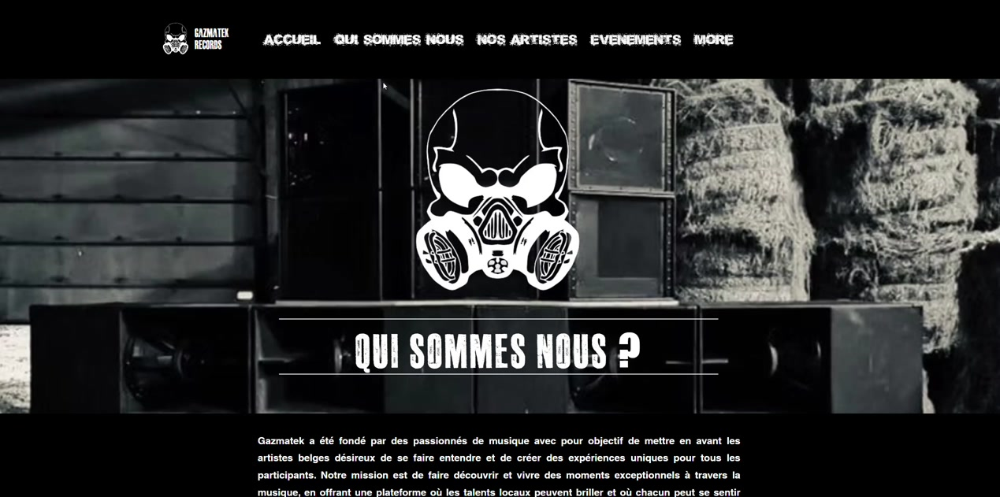

### Team section

The walkthrough also confirms a real team grid with role-driven cards:

- Directeur artistique
- Directeur technique
- Ingenieur son
- Manager label graphiste
- Web designer
- Photographe

Reference:

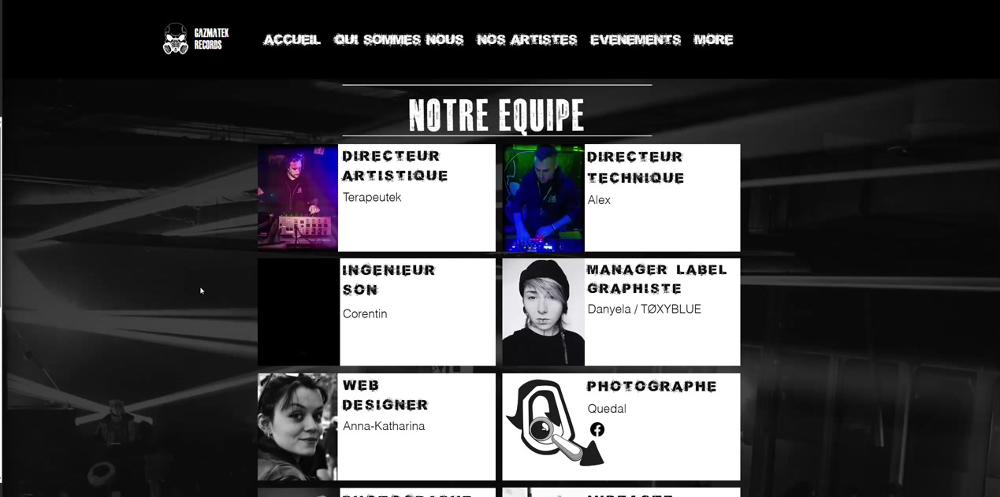

### Rebuild implications

- About should keep both manifesto copy and team roles
- Team should be modeled as structured content, not just free text

## 3. Artists page

The artist listing is a dense black-and-white visual grid of resident cards.

References:

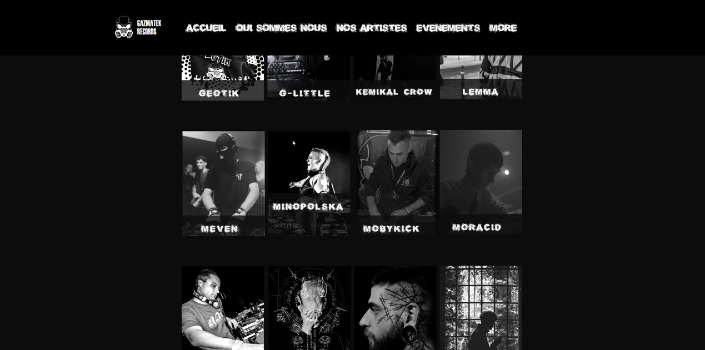

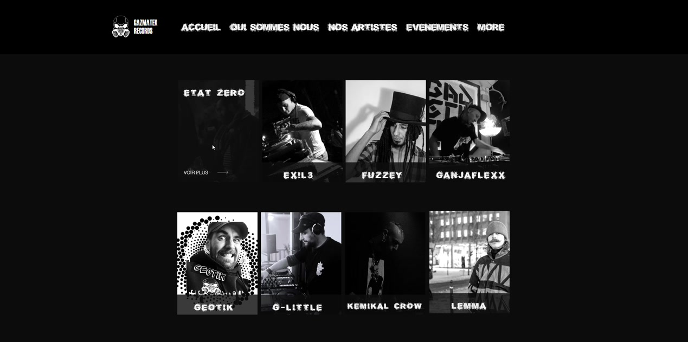

The old site also uses a media block between artist sections:

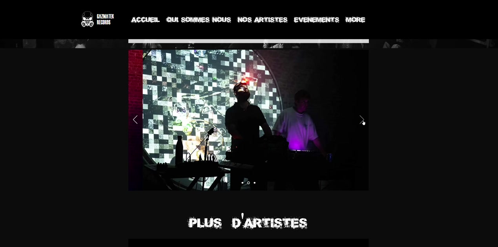

### Artist detail page

Artist detail is a simple composition:

- artist name
- style
- short text block
- large visual/gallery block underneath

Reference:

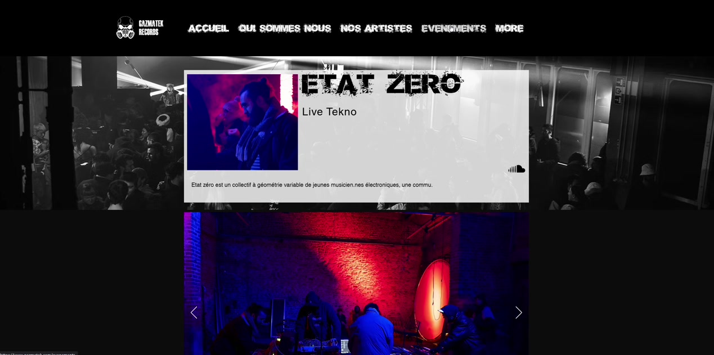

### Rebuild implications

- Keep artists visual and gallery-friendly
- Replace the dense legacy grid with a cleaner version, but keep the strong portrait-led identity
- Artist detail should stay simple and media-first

## 4. Events / archives page

The old site archive is presented as a vertical timeline list, not a standard card grid.

References:

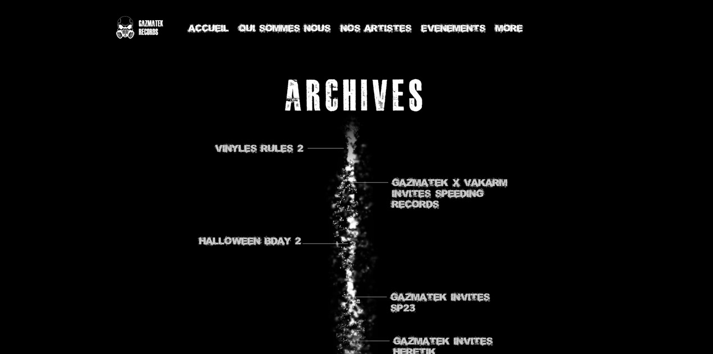

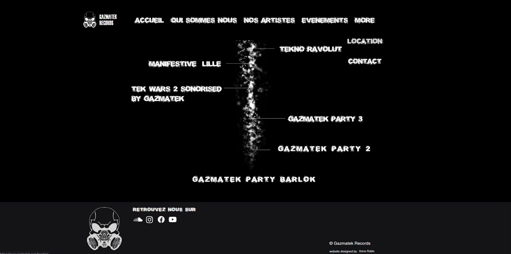

### Rebuild implications

- The archive timeline motif is worth preserving
- We should modernize it into a cleaner, data-driven archive UI
- Event names should be normalized; the old visual concept is useful, the raw strings are not
- The glowing vertical line should be recreated as a lightweight visual effect in SCSS/CSS and optional JS, not embedded as a heavy video asset

## 5. Services / location page

The legacy location page confirms three important things:

- the title is "Location"
- the page is product-photo driven
- there is both a grid view and a detail/specs view

References:

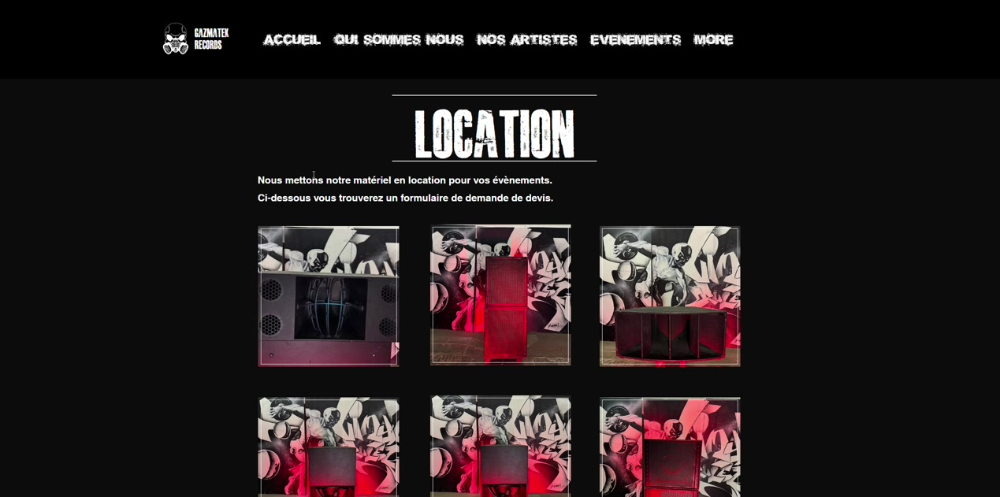

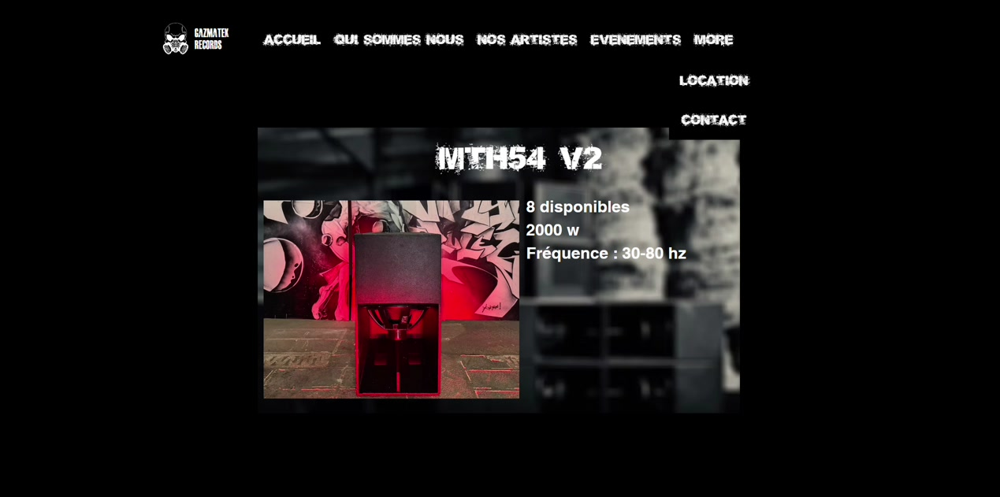

### Quote form

There is a dedicated "Demande devis" section with:

- first name
- last name
- email
- phone
- event type
- message
- submit CTA

Reference:

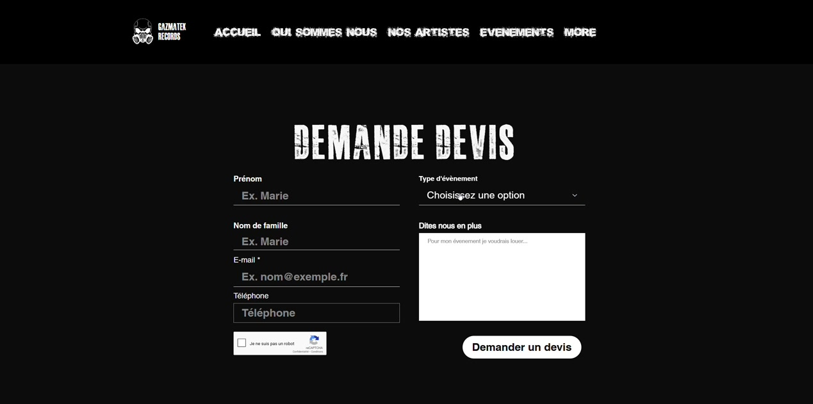

### Rebuild implications

- Services page should combine:
  - service framing
  - equipment catalog
  - quote CTA
- A product-detail overlay or detail section can be useful later, but launch can start with a cleaner grid + content block

## What to preserve

- black-heavy visual direction
- distressed condensed headings
- event-first homepage
- visible team roles
- artist-heavy identity
- archive timeline idea
- service page tied to actual equipment

## What to improve

- readability and spacing
- content hierarchy
- bilingual structure
- typed data instead of hardcoded page-specific content
- cleaner forms
- more modern responsive behavior

## Priority screenshots for rebuild

If we only keep a small subset open while developing, use these:

- Home: `walk-01.jpg`
- About intro: `walk-04.jpg`
- Team: `walk-06.jpg`
- Artists index: `walk-09.jpg`
- Artist detail: `walk-13.jpg`
- Archives: `walk-16.jpg`
- Services grid: `walk-18.jpg`
- Quote form: `walk-19.jpg`
- Equipment detail: `walk-21.jpg`
