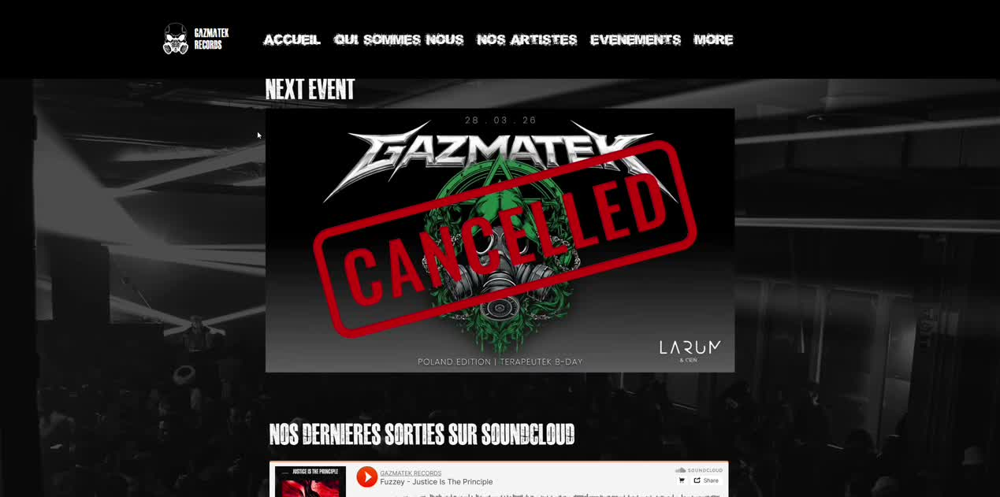

# Epic 1 - Page accueil

## Objectif

Construire une homepage claire, forte et rapide a comprendre. La home doit affirmer Gazmatek comme collectif, organisateur d'evenements, univers artistes et partenaire technique, tout en restant pilotee par les vraies sources legacy.

## References obligatoires

- [asset-inventory-old-website.md](../asset-inventory-old-website.md)
- [content-audit-old-website.md](../content-audit-old-website.md)
- [old-site-walkthrough.md](../old-site-walkthrough.md)

Reference visuelle principale :

## Contenu a reprendre depuis l'ancien site

- Hero :
  - branding Gazmatek
  - logique event-first visible dans le walkthrough
  - positionnement collectif / evenements / services
- Intro collectif :
  - version courte issue du manifeste legacy
- Bloc musique :
  - logique de section SoundCloud / sorties visible sur l'ancienne home
- Apercu artistes :
  - selection depuis `Bio_artistes.pdf` et les dossiers artistes
- Apercu services :
  - bases de texte depuis les services deja presents dans le projet

## Regles contenu

- Repartir de ce que disait l'ancien site
- Reecrire proprement, mais ne pas inventer de promesse marketing generique
- Si une info n'existe pas clairement, rester factuel

## Mapping contenu par zone

- Hero :
  - reprendre le positionnement visible sur la home legacy
  - condenser en une proposition de valeur tres courte
  - utiliser le logo officiel et un wording lie aux evenements, artistes et services
- Intro collectif :
  - resumer le manifeste en 2 a 4 phrases maximum
  - source prioritaire : les PDFs du manifeste
- Bloc evenements :
  - utiliser les vrais noms, dates, lieux et lineups issus des dossiers events
  - ne jamais afficher de faux "next event"
- Bloc musique :
  - reprendre l'intention de la zone SoundCloud legacy
  - si aucun embed n'est pret, utiliser un texte court + CTA vers la plateforme reelle
- Apercu artistes :
  - utiliser noms, styles et bios courtes tires de `Bio_artistes.pdf` puis enrichis par les docs artistes
- Apercu services :
  - reprendre le fond du texte services deja present dans le projet
  - le raccourcir pour en faire un teaser de home, pas une page complete

## Story 1.1 - Hero

**Priorite:** Critique

### Criteres d'acceptation

- [x] Hero pleine largeur construit a partir de vrais assets Gazmatek
- [x] Utilisation du logo officiel, pas d'un placeholder
- [x] Logo et branding vectoriels ranges dans `src/assets/svg`
- [x] Images hero / event rangees dans `src/assets/img`
- [x] Le hero dit clairement :
  - collectif
  - evenements
  - services techniques / sound system
- [x] CTA principal vers les evenements
- [x] CTA secondaire vers services ou contact
- [x] Les gros titres suivent la direction typo legacy
- [x] Le hero existe en FR et EN
- [x] Le texte du hero est derive du positionnement legacy, puis nettoye pour la V2

---

## Story 1.2 - Intro collectif

**Priorite:** Haute

### Criteres d'acceptation

- [x] Un bloc court derive du manifeste est present sur la home
- [x] Il explique sans lourdeur :
  - le noyau operationnel
  - l'autogestion
  - la reinjection dans le son, la production et les events
- [x] Il reste court sur la home et renvoie vers `/about` pour la version longue
- [ ] Le texte source vient explicitement des PDFs du manifeste legacy
- [ ] La story precise quelles phrases source ont ete retenues ou fusionnees

---

## Story 1.3 - Trois piliers

**Priorite:** Haute

### Criteres d'acceptation

- [x] Trois piliers visibles :
  - evenements
  - artistes / records
  - services / location
- [x] Chaque pilier renvoie vers une vraie page
- [x] Le wording est base sur le contenu legacy, pas sur du marketing invente
- [x] Les titres gardent l'energie graphique du vieux site sans casser la lisibilite
- [ ] Chaque pilier a une phrase de support basee sur une source legacy identifiable

---

## Story 1.4 - Bloc evenements mis en avant

**Priorite:** Haute

### Criteres d'acceptation

- [x] La home consomme la collection `events`
- [x] L'evenement a venir passe en premier
- [x] Si aucun evenement a venir n'existe, la home bascule sur des highlights d'archives
- [x] Chaque carte affiche :
  - poster
  - date
  - lieu
  - lineup court
  - CTA
- [x] Aucun texte placeholder n'est conserve
- [x] Les descriptifs courts sont derives des vraies donnees event ou restent minimalistes si les archives sont pauvres

---

## Story 1.5 - Bloc musique / sorties

**Priorite:** Moyenne

### Criteres d'acceptation

- [x] La home inclut un bloc musique inspire de la section SoundCloud legacy
- [x] Le bloc peut prendre la forme :
  - d'un embed
  - d'une liste de sorties
  - d'un bloc plus light avec CTA vers SoundCloud
- [x] Il est present tot dans le flux de page
- [x] Il ne prend pas le dessus sur le bloc evenements
- [x] Les labels FR/EN existent
- [x] Le texte d'accompagnement reprend l'intention legacy sans inventer de discours label fictif

---

## Story 1.6 - Apercu artistes residents

**Priorite:** Moyenne

### Criteres d'acceptation

- [x] La home affiche une selection courte d'artistes residents
- [x] Les donnees viennent de la meme source que `/artists`
- [x] Chaque carte affiche image, nom, style et lien detail
- [x] Le contenu bio court est derive des sources artistes, pas invente
- [x] Le bloc reste lisible sur mobile
- [x] Le critere de selection des artistes featured est documente

---

## Story 1.7 - Apercu services

**Priorite:** Moyenne

### Criteres d'acceptation

- [x] La home contient un teaser services / materiel
- [x] Il s'appuie sur les vrais assets `photos_materiel`
- [x] Il reprend le fond des services deja presents dans le projet
- [x] Il renvoie vers `/services`
- [x] Le texte reste concis et credible
- [x] Le teaser reformule le copy existant en mode home, sans dupliquer le futur contenu long de `/services`

---

## Story 1.8 - CTA final et reseaux

**Priorite:** Moyenne

### Criteres d'acceptation

- [x] La fin de page renforce la presence sociale / musique comme sur le legacy
- [x] Le CTA final pointe vers le contact et les reseaux principaux
- [x] Le footer n'est pas duplique inutilement dans le corps de page

---

## Definition of done

La home fait comprendre Gazmatek rapidement, montre de vraies preuves d'activite et pousse vers les trois parcours utiles : evenements, artistes, services.

---

## Etat au 2026-04-11

### Code fonctionnel

- Toutes les sections sont implantees et buildent sans erreur
- Les donnees dynamiques (events, artistes, services) viennent des vraies sources
- i18n FR/EN complet sur toutes les sections
- Fallbacks corrects : archive si pas d'event a venir, placeholder si photo artiste absente

### Assets integres

Tous les assets manquants ont ete copies depuis `old-website-assets/` :

| Asset | Source | Destination |
|---|---|---|
| Hero bg | `Images_Illustration/BV1A0369-Avec accentuation-Bruit_edited.jpg` | `src/assets/img/hero/hero-bg.jpg` |
| SoundCloud bg | `Images_Illustration/2023-06-27 23.54.17.jpg` | `src/assets/img/soundcloud-bg.jpg` |
| Cantik | `Artiste/Cantik/429665212_...n.jpg` | `src/assets/img/artists/cantik.jpg` |
| Ecleptix | `Artiste/Ecleptix/Ecleptix Picture.jpg` | `src/assets/img/artists/ecleptix.jpg` |
| Terapeutek | `Artiste/Terapeutek/370225899_...n.jpg` | `src/assets/img/artists/terapeutek.jpg` |
| Toxyblue | `Artiste/Toxyblue/Unknown-2.jpg` | `src/assets/img/artists/toxyblue.jpg` |
| Mobykick | `Artiste/Mobykick/att.-5LP1B...jpg` | `src/assets/img/artists/mobykick.jpg` |
| Biomystic | `Artiste/Biomistic/DSC01239.jpg` | `src/assets/img/artists/biomystic.jpg` |
| Equipment 1 | `photos_materiel/NuQ122-AN.jpg` | `src/assets/img/materiel/equipment-1.jpg` |
| Equipment 2 | `photos_materiel/EAW KF750.jpg` | `src/assets/img/materiel/equipment-2.jpg` |
| Equipment 3 | `photos_materiel/NEXO ALPHA _ B1-15.jpg` | `src/assets/img/materiel/equipment-3.jpg` |

### Traçabilite contenu (1.2 et 1.3)

Les textes de CollectiveIntro et ThreePillars sont derives du positionnement Gazmatek existant dans le projet, mais ne citent pas explicitement les PDFs du manifeste legacy. Une relecture avec `Bio_artistes.pdf` et les documents du manifeste est necessaire pour valider la conformite source.
